  

  
  

### About me

I'm a software engineer at [Boardy](https://www.boardy.ai/). Boardy is an AI superconnector: you talk to it, it gets to know what you're working on, and it introduces you to the people you should meet.

  

### Right now

- 📦 Building [Boardy](https://www.boardy.ai/)
- 🧠 Working on AI agents, full-stack systems, and product engineering
- 💬 Ask me about Boardy, AI products, or engineering at a startup
- 📫 Reach me at **nathen@boardy.ai**

### What I build with

  

### Previous projects

| Project | What it does |
| --- | --- |
| [**ProfAI**](https://profai.io/) | Generates lectures from slide decks with AI |
| [**TrueChamp**](https://truechamp.io/) | A social app built around challenges and streaks |

---

  Need an intro? <a href="https://www.boardy.ai/">Talk to Boardy</a>.

